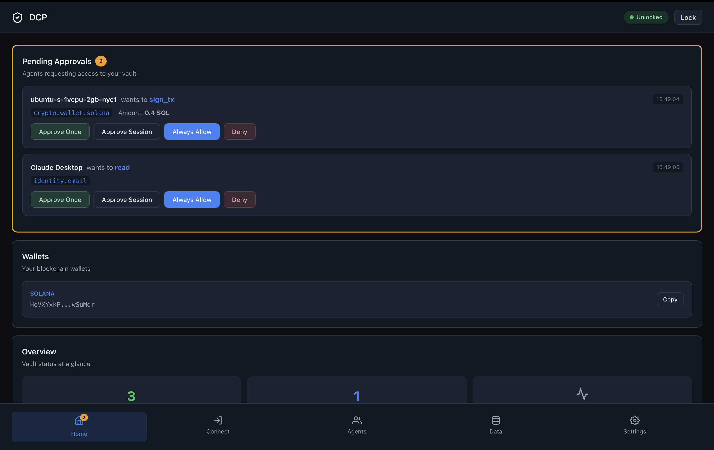
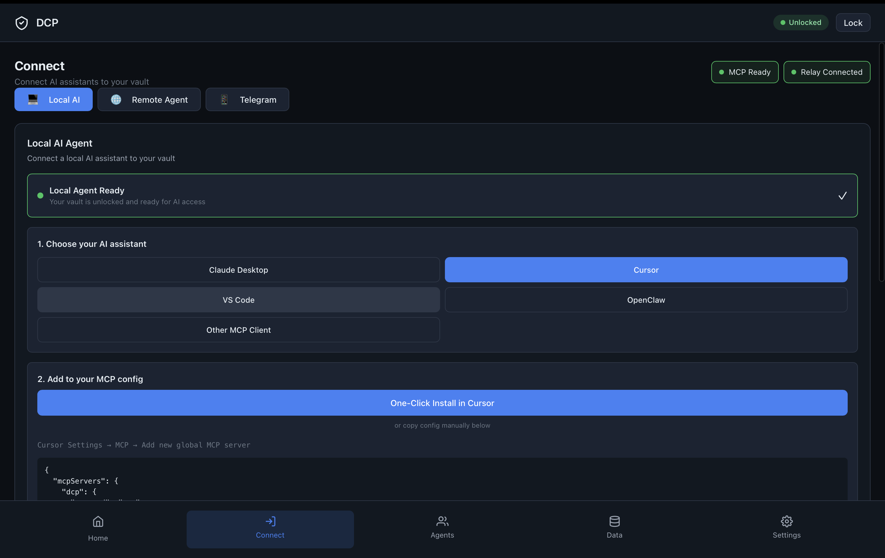
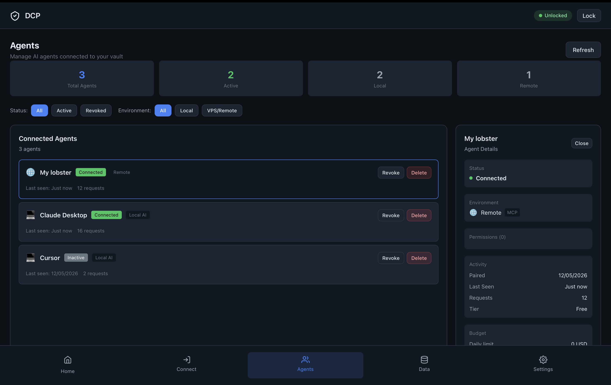

# DCP

[](https://www.npmjs.com/package/@dcprotocol/agent)
[](LICENSE)
[](https://github.com/1lystore/dcp-releases/releases/latest)

**Give AI agents permissions. Not your keys.**

**[⬇ Download DCP Desktop](https://github.com/1lystore/dcp-releases/releases/latest)** — macOS (Apple Silicon &amp; Intel), Windows, Linux. Or start at [dcpagent.com](https://dcpagent.com/).

Use DCP if your AI agent needs to use wallets, API keys, credentials, or user data, but you do not want those secrets sitting in agent configs or `.env` files.

DCP sits between your agents and your sensitive actions.

Agents ask. You approve, deny, budget, or revoke.

<video src="https://dcpagent.com/makeagentsafeforwork.mp4" controls muted loop playsinline width="100%"></video>

[Watch the 15-second demo](https://dcpagent.com/makeagentsafeforwork.mp4)

## Use DCP If

- you run Claude, Cursor, OpenClaw, Hermes, or custom MCP agents
- your agent needs to send, swap, or sign Solana transactions without holding a private key
- your agent needs API keys without reading `.env`
- you want spending limits for agents
- you want approval before sensitive actions
- you run multiple agents and want one place to manage credentials, permissions, and activity logs

## Why DCP?

Agents are useful when they can do real work. Real work needs keys, wallets, credentials, and user data.

The problem is giving an agent raw access is too much trust.

DCP gives agents a permission boundary:

- they ask for what they need
- you approve sensitive actions
- budgets limit damage
- private keys stay in your vault
- every action is logged

## What It Does

- stores wallets, API keys, and user data locally
- lets agents request access through MCP
- asks you before sensitive actions
- signs transactions without exposing private keys
- enforces per-agent budgets
- logs what agents did

DCP exposes vault permissions through MCP, so Claude Desktop, Cursor, OpenClaw, Hermes, and custom agents can request approved actions without reading raw secrets directly.

## 5-Minute Quickstart

By the end, your agent can ask DCP for your Solana wallet address.

### Local Agent

1. Download DCP Desktop from [dcpagent.com](https://dcpagent.com/).
2. Create and unlock your vault.
3. Create a Solana wallet.
4. Open **Connect** and add Claude Desktop, Cursor, Hermes, or another MCP agent.
5. Restart your agent app.

Then ask your agent:

```text
What is my Solana wallet address from DCP?
```

### Remote Agent

For OpenClaw, Hermes, or any agent running on a VPS, create a remote invite in DCP Desktop and run the generated command on the VPS:

```bash
curl -fsSL https://dcpagent.com/install.sh | sudo bash -s -- 'dcp_vps_v1_...'
```

Approve the verification phrase in Desktop. The installer pairs the VPS, starts DCP as a systemd service, and configures OpenClaw or Hermes when either is detected.

Good install output ends with:

```text
DCP service health: ok
Hermes config written: yes
Hermes config verified: yes
```

For OpenClaw, start a fresh chat/session. For Hermes, run:

```text
/reload-mcp
```

### Cloud Agent (paste a link)

For agents you do not host — Claude.ai, ChatGPT, or hosted OpenClaw/Hermes — there is nothing to
install. In DCP Desktop, generate a connect link and paste it into the agent:

```text
dcp_connect_v1_...
```

The link is **single-use**, expires in ~10 minutes, and carries **no permissions**. It pins your
vault's public key so the relay cannot impersonate your vault. The agent reaches your on-device
vault through the DCP relay (an end-to-end-encrypted MCP facade), and **you approve the connection
on your device** before anything is granted. Scopes, budgets, and revocation stay in your vault.

### CLI

Use the CLI to create and manage vault data:

```bash
npm install -g @dcprotocol/vault @dcprotocol/agent
dcp init
dcp create-wallet --chain solana
dcp add credentials.api.openai
dcp list
```

Once a local stdio MCP client is configured, it runs:

```json
{
  "command": "dcp-agent",
  "args": ["run", "--mode", "mcp", "--agent", "claude_desktop"]
}
```

## Try These Prompts

```text
What is my Solana wallet address from DCP?

Read my OpenAI credential from DCP.

Check if sending 0.01 SOL is within my DCP budget.

Request approval to sign a Solana transaction.
```

## How It Works

```text
Claude / Cursor / OpenClaw / Hermes
        |
        v
    dcp-agent
        |
        v
 Local DCP vault
        |
        v
 approve / deny / budget / revoke
        |
        v
 wallets, API keys, identity data
```

The agent asks for an action. The vault checks policy. If approval is needed, DCP creates a consent request. The agent gets only the result, not the raw private key.

## What Approval Shows

When an agent requests a sensitive action, DCP shows:

- which agent is asking
- what action it wants
- amount, chain, and destination for payments
- whether the request is within budget
- approve or deny controls

## Screenshots

### Real-time approval



### MCP connection



### Multiple agents



## Security Model

DCP is designed around least privilege.

- private keys never leave the local vault
- agents receive results, not raw private keys
- sensitive actions can require explicit approval
- budgets limit automated spending
- scopes control which data an agent can request
- access can be revoked per agent
- sensitive activity is logged

## Supported Today

- Solana transfers and swaps (build, budget-check, approve, sign, submit)
- Solana transaction and message signing
- wallet balances, token search, and transaction history
- scoped vault reads and writes
- API credential storage
- budget checks
- stdio MCP for Claude Desktop, Cursor, Hermes, and similar clients
- HTTP MCP for local or custom agents
- Desktop approvals
- Telegram approvals
- remote/VPS OpenClaw and Hermes agents through relay

## MCP Tools Exposed

DCP exposes these MCP tools:

- `vault_get_address`
- `vault_budget_check`
- `vault_scope_guide`
- `vault_sign_tx`
- `vault_sign_message`
- `vault_sign_x402`
- `vault_read`
- `vault_write`

## What Agents Can Request

- wallet address
- transaction signature
- message signature
- API credential access
- identity or profile data
- budget check

## What Agents Cannot Do

- read private keys
- bypass approval
- access scopes they were not granted
- spend past configured limits
- silently export the vault

## Desktop App

Prefer a GUI? Download DCP Desktop from [dcpagent.com](https://dcpagent.com/).

## Desktop Flow

DCP Desktop is the easiest way to get started.

1. Download DCP Desktop for macOS, Windows, or Linux.
2. Create a vault with a password/passphrase.
3. Save your recovery phrase safely.
4. DCP creates a Solana wallet for you.
5. Add private data or credentials in the Data tab.
6. Connect local agents like Claude, Cursor, VS Code, OpenClaw, Hermes, or any MCP client.
7. Set permissions per agent.
8. Approve, deny, budget, revoke, and audit every action agents ask for.

## Remote Agents

For a VPS or remote agent, create an invite in DCP Desktop and run the generated command:

```bash
curl -fsSL https://dcpagent.com/install.sh | sudo bash -s -- 'dcp_vps_v1_...'
```

That one command:

- installs a private DCP Node runtime when the VPS does not already have compatible Node.js
- installs `@dcprotocol/agent` under `/var/lib/dcp-agent`
- creates and starts `dcp-agent.service`
- pairs the VPS with your Desktop vault through the relay
- starts HTTP MCP on the VPS
- configures OpenClaw and Hermes when either is detected

Host-native Hermes uses `~/.hermes/config.yaml`. Docker Hermes uses `/opt/data/config.yaml` inside the Hermes container and gets a Docker-reachable DCP URL instead of `127.0.0.1`.

If Hermes is not detected or automatic config is not verified, run these on the remote host as the Hermes user:

```bash
hermes config set mcp_servers.dcp.url http://127.0.0.1:8420/mcp
hermes config set mcp_servers.dcp.enabled true
hermes config set mcp_servers.dcp.tools.prompts false
hermes config set mcp_servers.dcp.tools.resources false
```

Then run `/reload-mcp` in Hermes or restart Hermes.

If OpenClaw and Hermes run on the same VPS, they can share the same DCP MCP endpoint. The installer preserves the OpenClaw config shape and only changes the DCP service runtime so systemd runs the installed package directly.

## Packages

| Package | Purpose |
|---|---|
| `@dcprotocol/vault` | Vault CLI and local vault server |
| `@dcprotocol/agent` | MCP, HTTP MCP, and remote sidecar runtime |
| `@dcprotocol/core` | Crypto, storage, wallet, policy, and shared types |
| `@dcprotocol/relay` | Encrypted relay for remote agents |
| `@dcprotocol/telegram` | Telegram approval service |
| `@dcprotocol/desktop` | Desktop vault app |

## Developer Checks

```bash
pnpm install
pnpm -r run typecheck
pnpm -r run test
pnpm -r run build
node scripts/publish-guard.mjs
./scripts/test-security.sh
```
